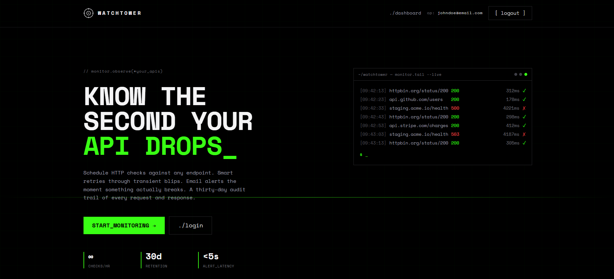
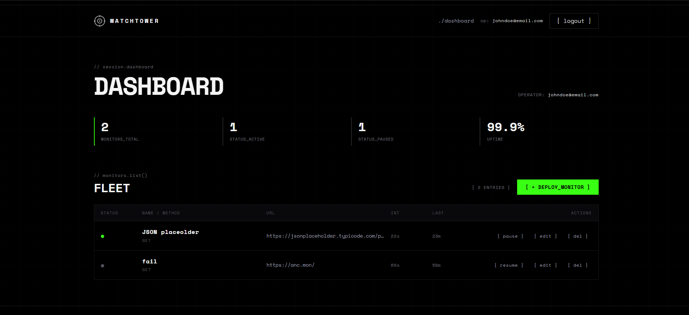
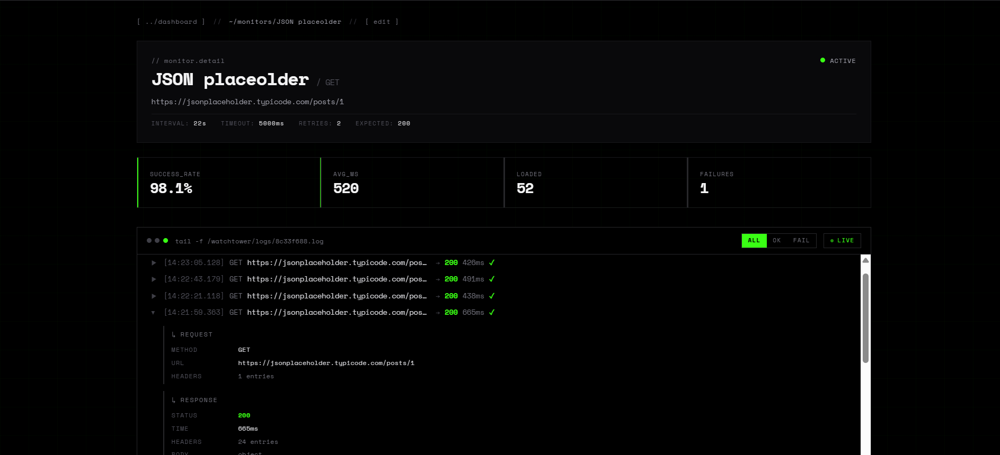
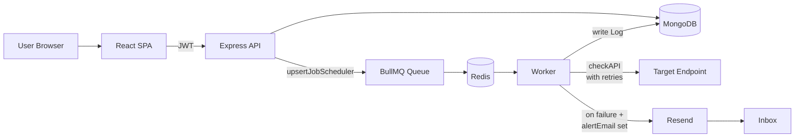

# Watchtower

> Self-hosted API uptime monitoring with smart retries, instant alerts, and a thirty-day audit trail of every request and response.

Watchtower lets you point at any HTTP endpoint, schedule recurring checks against it, assert on status codes or response body content, and get an email the moment something actually breaks. Every check is persisted with full request/response bodies so you can drill into a failure post-hoc.

<p align="center">
  
</p>

---

## Features

- **Scheduled HTTP checks** — interval-based (`every: N seconds`) or cron expressions, per-monitor.
- **Smart retries** — configurable per-monitor retry count rides through transient blips. Only the final result is logged, so flaky networks do not produce noisy alert spam.
- **Match logic** — assert on expected status code and/or substring match in the response body. Catches silent regressions in API contracts.
- **Email alerts via Resend** — failure emails sent to a per-monitor address. Optional. Leave blank to disable.
- **Custom request shape** — set headers, query parameters, and a JSON or raw-text body. Watchtower forwards them on every check.
- **Pause / resume** — toggle a monitor without deleting it. Schedule resumes from where it left off.
- **Live log tail** — terminal-style log viewer with auto-refresh, filter (all / ok / fail), and click-to-expand request/response details.
- **30-day retention** — logs auto-expire via a MongoDB TTL index. No cleanup cron required.
- **Self-healing** — on server boot, Watchtower reconciles all active monitors with the queue, so a Redis wipe never loses scheduled checks.
- **Multi-tenant** — every monitor is owned by a user. Auth via JWT. Users only see and operate on their own monitors.

---

## Screenshots





<!-- SCREENSHOT-4: Create monitor form -->
<!--  -->

<!-- SCREENSHOT-5: Login page (optional) -->
<!--  -->

---

## Tech Stack

| Layer            | Technology                                                |
| ---------------- | --------------------------------------------------------- |
| Backend runtime  | Node.js, Express 5                                        |
| Datastore        | MongoDB (Mongoose)                                        |
| Job queue        | BullMQ on top of Redis (ioredis)                          |
| HTTP client      | axios                                                     |
| Auth             | bcryptjs + jsonwebtoken (JWT in `Authorization` header)   |
| Email            | Resend                                                    |
| Frontend         | React 19, Vite, Tailwind CSS 4                            |
| Frontend state   | Zustand (with `persist` middleware)                       |
| Routing          | React Router 7                                            |
| Aesthetic        | Brutalist / terminal — Space Mono, neon green on black    |
| Local infra      | Docker Compose (MongoDB + Redis + GUIs)                   |

---

## Architecture



**Flow of a single check:**

1. User creates a monitor in the UI. The controller writes the monitor to MongoDB, then calls `scheduleMonitor()`, which `upsertJobScheduler`s a recurring spec into Redis with the monitor's ID.
2. BullMQ's internal scheduler materializes a job from the spec on the next tick.
3. The worker picks up the job, refetches the monitor from MongoDB (so any edits between scheduling and execution are honored), and runs `checkAPI` with retries.
4. The final result is persisted as a `Log` document and the monitor's `lastRunAt` is bumped.
5. If the check failed and the monitor has an `alertEmail` set, the worker calls Resend to send a plain-text alert.
6. The frontend's logs page polls the `/logs/:id` endpoint every 10 seconds for live tail behavior.

---

## Quick Start

### Prerequisites

- Node.js 20+
- Docker (for local MongoDB and Redis)
- A Resend API key, only if you want email alerts (free tier is fine)

### 1. Clone

```bash
git clone <your-repo-url> api-monitor
cd api-monitor
```

### 2. Start MongoDB and Redis

```bash
cd backend
docker compose up -d
```

This starts four containers:

- `watchtower-db` — MongoDB on port `27017`
- `watchtower-redis` — Redis on port `6379`
- `watchtower-mongo-gui` — Mongo Express at [http://localhost:8081](http://localhost:8081)
- `watchtower-redis-gui` — RedisInsight at [http://localhost:8001](http://localhost:8001)

### 3. Configure backend environment

Create `backend/.env`:

```env
PORT=5000
MONGO_URI=mongodb://localhost:27017/watchtower
JWT_SECRET=replace-this-with-a-long-random-string
REDIS_HOST=localhost
REDIS_PORT=6379

# Optional — email alerts. Without these, failures still log but no email goes out.
RESEND_API_KEY=re_yourkeyhere
RESEND_FROM=Watchtower <alerts@yourdomain.com>
```

If `RESEND_FROM` is omitted, Watchtower falls back to `Watchtower <onboarding@resend.dev>`. That sender only delivers to the email tied to your Resend account — sufficient for testing, not for production.

### 4. Install and run the backend

```bash
cd backend
npm install
npm run dev
```

You should see:

```
Server running on port 5000
MongoDB connected
Reconciled 0 monitors (0 active scheduled)
```

### 5. Install and run the frontend

```bash
cd frontend
npm install
npm run dev
```

Open [http://localhost:5173](http://localhost:5173).

### 6. Smoke test

Register an account on `/register`, log in, click `[ + DEPLOY_MONITOR ]`, and create a monitor against `https://httpbin.org/status/200` with `interval = 10` seconds. Within ten seconds the dashboard's `LAST` column updates and the log tail at `/monitors/:id/logs` starts filling in.

---

## Environment Variables

### Backend

| Variable          | Required | Default                                | Notes                                                                |
| ----------------- | -------- | -------------------------------------- | -------------------------------------------------------------------- |
| `PORT`            | Yes      | —                                      | API port. Frontend hardcodes `5000` currently.                       |
| `MONGO_URI`       | Yes      | —                                      | Mongo connection string.                                             |
| `JWT_SECRET`      | Yes      | —                                      | Used to sign and verify auth tokens. Use a long random value.        |
| `REDIS_HOST`      | No       | `localhost`                            | BullMQ connection.                                                   |
| `REDIS_PORT`      | No       | `6379`                                 | BullMQ connection.                                                   |
| `RESEND_API_KEY`  | No       | —                                      | Required if you want email alerts. Without it, alerts log a warning. |
| `RESEND_FROM`     | No       | `Watchtower <onboarding@resend.dev>`   | Verified sender. Default only delivers to the Resend account email.  |

### Frontend

The backend URL is currently hardcoded as `http://localhost:5000` in the page components. Production deployment requires extracting this to `import.meta.env.VITE_API_URL` and wiring through an axios instance. See [Roadmap](#roadmap).

---

## API Reference

All `/api/monitors/*` routes require `Authorization: Bearer <token>`.

### Auth

| Method | Path                  | Body                        | Returns                                    |
| ------ | --------------------- | --------------------------- | ------------------------------------------ |
| POST   | `/api/users/register` | `{name, email, password}`   | `{message, userId}`                        |
| POST   | `/api/users/login`    | `{email, password}`         | `{message, token, user: {id, email}}`      |

### Monitors

| Method | Path                              | Body / Params                            | Returns                                  |
| ------ | --------------------------------- | ---------------------------------------- | ---------------------------------------- |
| POST   | `/api/monitors/create`            | Monitor object (see below)               | `{message, monitor}`                     |
| GET    | `/api/monitors/getAll`            | —                                        | `{monitors: [...]}`                      |
| GET    | `/api/monitors/get/:id`           | —                                        | `{foundMonitor}`                         |
| PUT    | `/api/monitors/update/:id`        | Full monitor body, all required fields   | `{updatedMonitor}`                       |
| DELETE | `/api/monitors/delete/:id`        | —                                        | `{message}`                              |
| GET    | `/api/monitors/logs/:id`          | `?limit=50&skip=0`                       | `{logs: [...]}`                          |

### Monitor schema

```jsonc
{
  "name": "github-api",                      // required
  "url": "https://api.github.com/users",     // required
  "method": "GET",                           // required: GET | POST | PUT | DELETE
  "headers": { "Authorization": "Bearer x" },// optional, key/value
  "queryParams": { "page": "1" },            // optional, key/value
  "body": { "any": "json" },                 // optional, object or string
  "schedule": {
    "interval": 60                           // seconds — or "cron": "*/5 * * * *"
  },
  "timeoutMS": 5000,                         // optional, default 5000
  "retries": 2,                              // optional, default 2
  "expectedResponse": {
    "statusCode": 200,                       // optional
    "bodyContains": "ok"                     // optional substring match
  },
  "alertEmail": "oncall@example.com",        // optional — null disables alerts
  "status": "active"                         // active | paused, default active
}
```

### Log schema

```jsonc
{
  "monitorId": "...",
  "userId": "...",
  "request": { "method": "GET", "url": "...", "headers": {}, "body": null },
  "response": { "statusCode": 200, "headers": {}, "body": {}, "responseTime": 312 },
  "success": true,
  "error": { "message": null, "code": null },
  "runAt": "2026-04-25T..."
}
```

Logs auto-delete after thirty days via a MongoDB TTL index on `runAt`.

---

## Project Structure

```
api-monitor/
├── backend/
│   ├── config/
│   │   └── redis.js                # ioredis connection (shared by Queue + Worker)
│   ├── controllers/
│   │   ├── monitorController.js    # CRUD + logs endpoint
│   │   └── userControllers.js      # register, login
│   ├── middleware/
│   │   └── authMiddleware.js       # Bearer token verification
│   ├── models/
│   │   ├── Log.js                  # check history with 30-day TTL
│   │   ├── Monitor.js              # monitor config + schedule
│   │   └── User.js
│   ├── queues/
│   │   └── monitorQueue.js         # BullMQ Queue producer
│   ├── routes/
│   │   ├── monitorRoutes.js
│   │   └── userRoutes.js
│   ├── services/
│   │   ├── checkAPI.js             # the actual HTTP check function
│   │   ├── monitorScheduler.js     # schedule/unschedule/reconcile helpers
│   │   └── sendEmail.js            # Resend integration
│   ├── workers/
│   │   └── monitorWorker.js        # BullMQ Worker (consumer)
│   ├── docker-compose.yml          # Mongo + Redis + GUIs
│   └── server.js                   # Express bootstrap + reconciliation
└── frontend/
    └── src/
        ├── components/
        │   └── Layout.jsx          # nav, footer, status strip; Outlet wrapper
        ├── pages/
        │   ├── Landing.jsx         # public marketing page
        │   ├── Login.jsx
        │   ├── Register.jsx
        │   ├── Dashboard.jsx       # monitors list + row actions
        │   ├── MonitorForm.jsx     # create + edit (mode-switching)
        │   └── MonitorLogs.jsx     # terminal-style live log tail
        ├── stores/
        │   └── authStore.js        # Zustand + persist (token, user)
        ├── App.jsx                 # router only
        ├── main.jsx
        └── index.css               # Tailwind + Space Mono + animations
```

---

## How It Works

### Why store only `monitorId` in BullMQ jobs

A monitor's config can change between scheduling time and execution time — a user could edit the URL, headers, or schedule. If we put the full monitor in the job's `data` payload, the worker would run a stale snapshot. Instead, the job carries only `{monitorId}` and the worker refetches from Mongo on every execution. Trade-off: one extra read per check. Cheap, and the consistency guarantee is worth it.

### Why `monitor._id` is the BullMQ scheduler ID

Using the Mongo ObjectId as the scheduler ID makes scheduler operations idempotent and targeted:

- Creating the same monitor twice does not duplicate the schedule (`upsertJobScheduler` overwrites).
- Editing the schedule re-`upsertJobScheduler`s with the same ID and the new spec replaces the old one.
- Deleting calls `removeJobScheduler(id)` — surgical, no scan.

### Smart retries

Configurable per monitor via `monitor.retries` (default 2). The worker runs `checkAPI` up to `retries + 1` times, sleeping 500ms between attempts, and only persists the *final* result. Transient network blips do not produce noisy log entries or fire alert emails.

### Startup reconciliation

On server boot, `reconcileMonitors()` queries every monitor in Mongo and calls `scheduleMonitor()` on each. Active monitors with valid schedules get their scheduler specs upserted in Redis. Paused or schedule-less monitors get any orphaned scheduler entries removed. This means MongoDB is the single source of truth — Redis becomes pure cache, and `docker compose down -v` on Redis is a recoverable operation.

### Live log tail

The logs page maintains a `<Set>` of expanded log IDs and polls the logs endpoint every 10 seconds. New entries are diffed against the most recent loaded `_id` and prepended to the visible list — no full re-render, no lost scroll position. The `LIVE / PAUSED` toggle flips a state flag that both renders the pulsing indicator and gates a `liveRef` shadow inside the polling closure to avoid stale state.

---

## Roadmap

Things that exist but aren't polished, and things that don't exist yet.

### Important

- **Alert state-transition gating.** Currently every failed check fires an email. A monitor that goes down for 30 minutes at a 60s interval = 30 emails. Should only alert on `healthy → failing` transitions, plus optional "RESOLVED" email on `failing → healthy`.
- **Real uptime / success-rate aggregation.** The dashboard's `99.9%` placeholder and the logs page's stats both compute over loaded data only. Add `GET /api/monitors/:id/stats` aggregating Logs over 24h / 7d / 30d windows.
- **Tighten error responses.** Mongoose `ValidationError` and `CastError` should map to HTTP 400 with the underlying message instead of every error becoming a generic 500.

### Production hardening

- CORS allowlist (currently wide open).
- Rate limit on `/login` (brute-force protection).
- Server-side password length / format validation.
- Worker SIGTERM handler so in-flight jobs finish on shutdown.
- Response body size cap in `checkAPI` so a 10 MB target doesn't balloon Mongo.
- Email verification on register.

### Polish

- Extract `Field` component (currently duplicated across Login, Register, MonitorForm).
- `<RequireAuth>` wrapper to consolidate the per-page redirect-if-no-token pattern.
- Cron-schedule editor on the monitor form (interval-only today).
- Mobile responsiveness pass on Dashboard and Logs.
- Replace hardcoded `STATUS_BAR` numbers in the layout with real ones.

---

## Acknowledgements

- [BullMQ](https://docs.bullmq.io/) for the job queue and scheduler.
- [Resend](https://resend.com/) for the email API.
- [Tailwind CSS](https://tailwindcss.com/) for the design primitives.
- The [frontend-design](https://skills.sh/anthropics/skills/frontend-design) and [vercel-react-best-practices](https://skills.sh/vercel-labs/agent-skills/vercel-react-best-practices) skills for the aesthetic and React rules.

---

